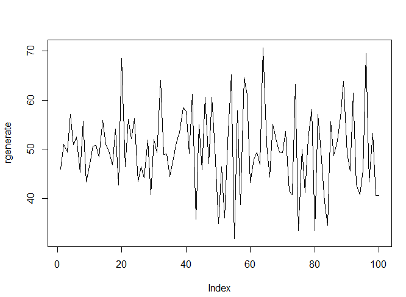

# P1_Probstat_D_5025201017
- Nama  : Muhammad Rolanov Wowor

## Soal 1
1a. Peluang penyurvei bertemu x = 3 orang yang tidak menghadiri acara vaksinasi
sebelum keberhasilan pertama

1b.m Mean Distribusi Geometrik dengan 10000 data random
Hasil dari 1a dan 1b:
<br>

<br>
1c. Berdasarkan hasil dari poin A dan B, Peluang dari poin A lebih besar dimana datanya lebih sedikit, dibandingkan poin B yang dimana datanya lebih banyak

1d. Histogram
```
#1d
n = 10000
ygeom <- rgeom(n, prob = p)
hist(ygeom, 
     main = "Histogram Distribusi Geometrik",
     xlab = "percobaan")
```
<br>

<br>

1e. Nilai rataan dan varian Distribusi Geometrik
<br>

<br>

## Soal 2
2a. Peluang 4 pasien yang sembuh
<br>

<br>
2b. Histogram kasus poin A
```
#2b
b <- plot(0:5,dbinom(0:5,size=20,prob=.2),
           type = 'h', #tipe plot menjadi histogram
           main='Distribusi Binomial',
           ylab='Probabilitas',
           xlab ='Pasien sembuh',
           lwd=3)

```
<br>

<br>
2c. Nilai rataan dan varian distribusi binomial
<br>

<br>

## Soal 3
3a. Peluang 6 bayi lahir besok
<br>

<br>
3b. Histogram simulai kelahiran 6 bayi selama 1 tahun
```
#3b
hist(rpois(x,lambda = 4.5),
     main = "Distribusi Poisson",
     ylab ="Frekuensi",
     xlab = "Distribusi",
     breaks = 365
    )

```
<br>

<br>
3c. Perbandingan hasil poin A dan B, dari poin A diketahui bahwa peluang untuk esok hari cukup tinggi, sementara di poin B, semakin lama waktu berlalu maka semakin kecil peluangnya untuk 6 bayi lahir di hari tersebut karena rata-rata kelahiran adalah 4 bayi(lebih rendah)

3d. Nilai rataan dan varian distribusi Poisson
<br>

<br>

## Soal 4
4a. Fungsi Distribusi Chi-Square
```
x <- 2
v <- 10
#4a
dchisq(x, v)
```
4b. Histogram dengan 100 data random
<br>

<br>
4c. Nilai rataan dan varian distribusi Poisson
<br>

<br>

## Soal 5
5a. Fungsi distribusi eksponensial
```
#5a
lambda <- 3
DistExponensial <- function(lambda, x){
  print((1/lambda) * exp((x/lambda)*-1))
}
DistExp <- dexp(x,lambda)
```
5b. Histogram dengan 10, 100, 1000, dan 10000 data random
<br>

<br>
5c. Nilai rataan dan varian dari Distribusi Eksponensial untuk 100 data dan lambda = 3
<br>

<br>

## Soal 6
6a. 
Fungsi Distribusi Normal dan Z score
<br>

<br>

Histogram random generate
<br>

<br>

6b. Histogram Distribusi Normal
<br>

<br>

6c. Nilai varian dari generate random nilai Distribusi Normal
<br>

<br>
